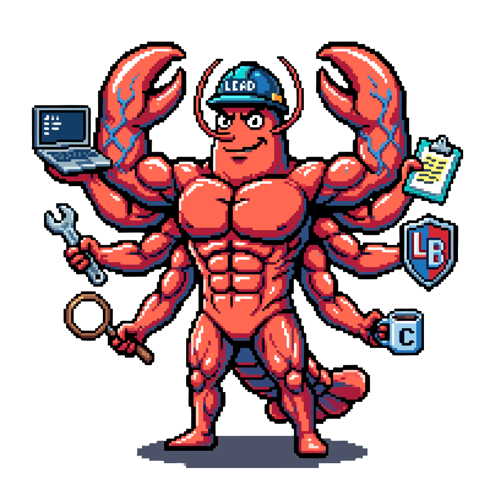

<p align="center">
  
  <h1 align="center">Oh My Team</h1>
  <p align="center">
    Multi-agent orchestration plugin for Claude Code.<br/>
    Turn your AI coding session into a coordinated development team.
  </p>
  <p align="center">
    <a href="https://www.npmjs.com/package/oh-my-team"></a>
    <a href="https://www.npmjs.com/package/oh-my-team"></a>
    <a href="https://github.com/erkandogan/oh-my-team/stargazers"></a>
    <a href="https://github.com/erkandogan/oh-my-team/blob/main/LICENSE"></a>
    <a href="https://github.com/erkandogan/oh-my-team/issues"></a>
    <a href="https://github.com/erkandogan/oh-my-team/commits/main"></a>
  </p>
  <p align="center">
    <a href="https://ohmyteam.cc">Website</a> &middot;
    <a href="#installation">Install</a> &middot;
    <a href="#quick-start">Quick Start</a> &middot;
    <a href="#agents">Agents</a> &middot;
    <a href="#skills">Skills</a>
  </p>
</p>

---

**Oh My Team** gives Claude Code a full development team. Drop the `/oh-my-team:team` command into any task and watch it spawn specialized agents — researchers, builders, reviewers — working in parallel across tmux split panes.

```
omt -d
> /oh-my-team:team Build an authentication system with OAuth and RBAC

Sisyphus creates the team:
  explorer-1    analyze existing auth patterns
  librarian-1   research OAuth best practices
  builder-auth  implement OAuth flow
  builder-rbac  implement role-based access
  reviewer      code quality review

5 tmux panes open, each agent working in parallel.
```

## Why Oh My Team?

| Without | With `/oh-my-team:team` |
|---------|----------------|
| One agent does everything sequentially | Specialized agents work in parallel |
| No visibility into what's happening | tmux panes show each agent live |
| Generic approach to every task | Right specialist for each job |
| No quality gates | Dedicated reviewer and security agents |
| Agent does work without planning | Structured: plan, execute, verify |

## Installation

### Claude Code Plugin (recommended)

Inside a Claude Code session:

```
/plugin marketplace add erkandogan/oh-my-team
/plugin install oh-my-team
```

Then run `/reload-plugins` to activate.

### npm

```bash
npm i -g oh-my-team
```

Installs the `omt` CLI and configures Claude Code automatically.

### Git clone

```bash
git clone https://github.com/erkandogan/oh-my-team.git
cd oh-my-team
./install.sh
```

The installer:
- Copies the plugin to `~/.oh-my-team/`
- Creates the `omt` CLI wrapper at `~/.local/bin/omt`
- Enables experimental agent teams in Claude Code settings
- Sets tmux split-pane mode for teammate visibility
- Installs a custom status line showing active agents and teams
- Checks for tmux (required for split-pane view)

### Requirements

- [Claude Code](https://claude.com/code) v2.1.32+
- [tmux](https://github.com/tmux/tmux/wiki) (for split-pane teammate view)

```bash
brew install tmux  # macOS
```

### Uninstall

```bash
rm -rf ~/.oh-my-team ~/.local/bin/omt
```

## Quick Start

```bash
# Start Oh My Team (launches inside tmux automatically)
omt

# With auto-approve permissions
omt -d          # shortcut for --dangerously-skip-permissions
omt --danger    # same thing

# Continue last session
omt -c

# All claude flags work
omt -d -c       # danger mode + continue
```

### Your first team

1. Start: `omt -d`
2. Trigger team mode with the `/oh-my-team:team` command:

```
/oh-my-team:team Build a REST API with user authentication
```

Sisyphus creates the team, spawns specialized agents in tmux panes, and coordinates them through completion.

### When to use `/team` vs direct prompts

- **Use `/oh-my-team:team`** when you want multiple agents working in parallel — research, implementation, review
- **Use a direct prompt** (no skill) for single-step tasks: "fix this typo", "explain how X works", "add error handling to this function"

Without `/team`, Claude Code will handle simple tasks directly — which is often faster. Use the skill when the task benefits from parallel specialists.

## Agents

Oh My Team provides 11 specialized agents, each with a focused role and optimized system prompt.

### Orchestration Layer

| Agent | Role | Model |
|-------|------|-------|
| **Sisyphus** | Team lead. Proposes teams, delegates work, coordinates, verifies results. Never codes directly. | Opus |
| **Atlas** | Plan conductor. Reads work plans, delegates to workers in parallel waves, verifies every result. | Sonnet |

### Planning Layer

| Agent | Role | Model |
|-------|------|-------|
| **Prometheus** | Strategic planner. Interviews users, researches codebase, generates detailed work plans. Read-only. | Opus |
| **Metis** | Gap analyzer. Catches hidden intentions, ambiguities, and scope creep risks before plan generation. | Opus |
| **Momus** | Plan reviewer. Validates plans for executability. Approval-biased -- only rejects for true blockers. | Opus |

### Worker Layer

| Agent | Role | Model |
|-------|------|-------|
| **Hephaestus** | Autonomous implementation worker. Full tool access. Explores patterns, implements end-to-end. | Opus |
| **Explorer** | Fast codebase search. Finds files, patterns, and code structure. Multiple can run in parallel. | Haiku |
| **Librarian** | Documentation and OSS research. Finds official docs, best practices, production patterns. | Haiku |
| **Oracle** | Architecture consultant. Read-only. Pragmatic minimalism. Use for hard debugging and design decisions. | Opus |

### Review Layer

| Agent | Role | Model |
|-------|------|-------|
| **Reviewer** | Code quality across 10 dimensions: correctness, patterns, naming, errors, types, performance, abstraction, testing, API design, tech debt. | Opus |
| **Security Auditor** | 10-point security checklist: input validation, auth/authz, secrets, data exposure, dependencies, crypto, path traversal, error leakage. | Opus |

## Skills

Skills are slash commands that trigger workflows.

### Team skills (spawn agent teams)

| Skill | Purpose |
|-------|---------|
| `/oh-my-team:team` | Spawn an agent team with tmux panes for any task |
| `/oh-my-team:plan` | Prometheus interview + Metis gap analysis + optional Momus review |
| `/oh-my-team:start-work` | Atlas reads a plan and orchestrates execution with workers |
| `/oh-my-team:review-work` | 5-agent parallel review: goals, QA, quality, security, context |
| `/oh-my-team:deep-debug` | Multi-hypothesis parallel debugging with competing investigators |

### Utility skills (no team, solo operation)

| Skill | Purpose |
|-------|---------|
| `/oh-my-team:git-master` | Atomic commit workflow with logical grouping |
| `/oh-my-team:ai-slop-remover` | Detect and remove AI-generated code patterns |
| `/oh-my-team:frontend-ui-ux` | Frontend development guidance (auto-loaded for UI work) |

### Workflow: Plan, Execute, Review

```
1. /oh-my-team:plan "Add OAuth authentication"
   -> Prometheus interviews you, researches codebase, generates plan

2. /oh-my-team:start-work auth-plan
   -> Atlas reads plan, spawns workers, executes in parallel waves

3. /oh-my-team:review-work
   -> 5 agents review in parallel: goals, QA, quality, security, context
```

### Workflow: Deep Debug

```
/oh-my-team:deep-debug "Login returns 500 after token refresh"
-> Spawns 3-5 investigators with competing hypotheses
-> They challenge each other's findings
-> Converge on the root cause
```

## Architecture

```
+-------------------------------------------------+
|              Oh My Team Plugin                   |
+-------------------------------------------------+
|                                                  |
|  Orchestration    Sisyphus (lead)                |
|  Layer            Atlas (conductor)              |
|                                                  |
|  Planning         Prometheus -> Metis ->         |
|  Layer            Momus (review)                 |
|                                                  |
|  Worker           Hephaestus (build)             |
|  Layer            Explorer (search)              |
|                   Librarian (research)           |
|                   Oracle (consult)               |
|                                                  |
|  Review           Reviewer (quality)             |
|  Layer            Security Auditor (security)    |
|                                                  |
+-------------------------------------------------+
|  Team       plan | start-work | review-work      |
|  Skills     team | deep-debug                     |
+-------------------------------------------------+
|  Utility    git-master | ai-slop-remover          |
|  Skills     frontend-ui-ux                        |
+-------------------------------------------------+
|  Status    Agent name | Team | Members            |
|  Line      Context bar | Cost | Rate limits       |
+-------------------------------------------------+
             Claude Code Plugin System
```

### How it works

Oh My Team is a **pure Claude Code plugin** -- 23 Markdown files, zero build step, zero dependencies. It leverages Claude Code's native systems:

- **Agents** (`agents/*.md`) -- System prompts with model and tool configurations
- **Skills** (`skills/*/SKILL.md`) -- Slash commands that trigger workflows
- **Hooks** (`hooks/hooks.json`) -- Session lifecycle automation
- **Agent Teams** -- Claude Code's experimental multi-session coordination
- **Status Line** -- Custom status bar showing active agents and teams

## Remote Control (Channels + Hub)

Control your agent teams from your phone. Start persistent sessions, connect Telegram/Discord, and manage multiple projects remotely.

### Always-alive sessions with `omt hub`

```bash
# Start a persistent session for a project
omt hub start ~/projects/my-app

# Start with Telegram channel — control from your phone
omt hub start ~/projects/my-app --telegram

# Manage sessions
omt hub list                    # show all active sessions
omt hub attach my-app           # jump into a session
omt hub stop my-app             # stop a session
omt hub status                  # overview
```

Sessions run in detached tmux — they stay alive when you close your terminal. Connect a channel to control them remotely.

### Supported channels

| Channel | Flag | Setup |
|---------|------|-------|
| Telegram | `--telegram` | Create bot via @BotFather, configure token |
| Discord | `--discord` | Create bot in Developer Portal, invite to server |
| iMessage | `--imessage` | macOS only, text yourself to start |

### Multi-project workflow

```bash
# Start sessions for different projects
omt hub start ~/projects/frontend --telegram
omt hub start ~/projects/backend --telegram
omt hub start ~/projects/mobile

# Check what's running
omt hub status

# Jump into any session
omt hub attach frontend
```

Each session is independent — different project, different agent teams, different context. Telegram messages arrive in whichever session has the channel connected.

### Channel setup (Telegram example)

```bash
# 1. Start session with Telegram
omt hub start ~/projects/my-app --telegram

# 2. Attach to configure
omt hub attach my-app

# 3. Inside the session, configure your bot token
/telegram:configure <your-bot-token>

# 4. Text your bot on Telegram — pair when prompted
/telegram:access pair <code>
/telegram:access policy allowlist

# 5. Detach (Ctrl+B, D) — session stays alive
# Now message your bot from your phone to control the session
```

> **Note**: Channels require Claude Code v2.1.80+ and are in research preview. They require claude.ai login (not API keys).

## Status Line

Oh My Team installs a custom status line at the bottom of Claude Code:

```
@sisyphus [my-team] 4 agents: explorer-1 librarian-1 builder-1 builder-2
|||||||________ 45% | $1.23 | 5m30s | 5h:18% 7d:5%
```

Shows: active agent, team name, teammate count, context usage (color-coded), session cost, duration, and rate limits.

## Project Structure

```
oh-my-team/
+-- .claude-plugin/
|   +-- plugin.json              # Plugin manifest
+-- settings.json                # Activates Sisyphus as default agent
+-- CLAUDE.md                    # Project instructions (team creation rules)
+-- agents/
|   +-- sisyphus.md              # Team lead / orchestrator
|   +-- prometheus.md            # Strategic planner
|   +-- atlas.md                 # Plan conductor
|   +-- oracle.md                # Architecture consultant
|   +-- hephaestus.md            # Implementation worker
|   +-- explorer.md              # Codebase search
|   +-- librarian.md             # Documentation research
|   +-- reviewer.md              # Code quality review
|   +-- security-auditor.md      # Security review
|   +-- metis.md                 # Gap analyzer
|   +-- momus.md                 # Plan reviewer
+-- skills/
|   +-- team/SKILL.md            # Force team mode
|   +-- plan/SKILL.md            # Planning workflow
|   +-- start-work/SKILL.md      # Execution workflow
|   +-- review-work/SKILL.md     # 5-agent review gate
|   +-- git-master/SKILL.md      # Commit workflow
|   +-- ai-slop-remover/SKILL.md # Code cleanup
|   +-- deep-debug/SKILL.md      # Multi-hypothesis debugging
|   +-- frontend-ui-ux/SKILL.md  # Frontend guidance
+-- hooks/
|   +-- hooks.json               # Auto-team injection hook
+-- install.sh                   # One-command installer
+-- README.md
```

## Contributing

Contributions are welcome! See [CONTRIBUTING.md](CONTRIBUTING.md) for guidelines.

### Adding a new agent

Create `agents/your-agent.md` with frontmatter:

```yaml
---
name: your-agent
description: "What this agent does and when to use it"
model: opus  # or sonnet, haiku
tools: [Read, Grep, Glob, Bash]  # tool restrictions
---

Your agent's system prompt here.
```

### Adding a new skill

Create `skills/your-skill/SKILL.md` with frontmatter:

```yaml
---
name: your-skill
description: "What this skill does"
argument-hint: "[arguments]"
---

Instructions for the skill.
```

## License

[MIT](LICENSE) -- Use it, fork it, make it yours.

## Credits

Inspired by [Oh My OpenCode](https://github.com/code-yeongyu/oh-my-opencode) by YeonGyu Kim. Built for [Claude Code](https://claude.com/code) by Anthropic.
